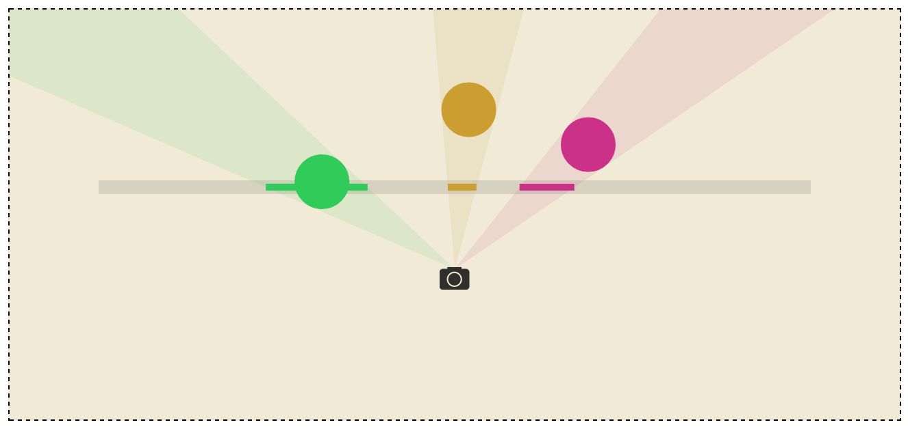

# Visualizing Projections

__[An interactive demonstration of intuitive projections](http://shaunlebron.github.io/visualizing-projections)__

Created to illustrate concepts in
[Blinky](http://github.com/shaunlebron/blinky), a demo exploring different
projections in Quake.

This illustration actually lead to a 1D game concept, [BL1ND](https://github.com/shaunlebron/bl1nd-ld28).
